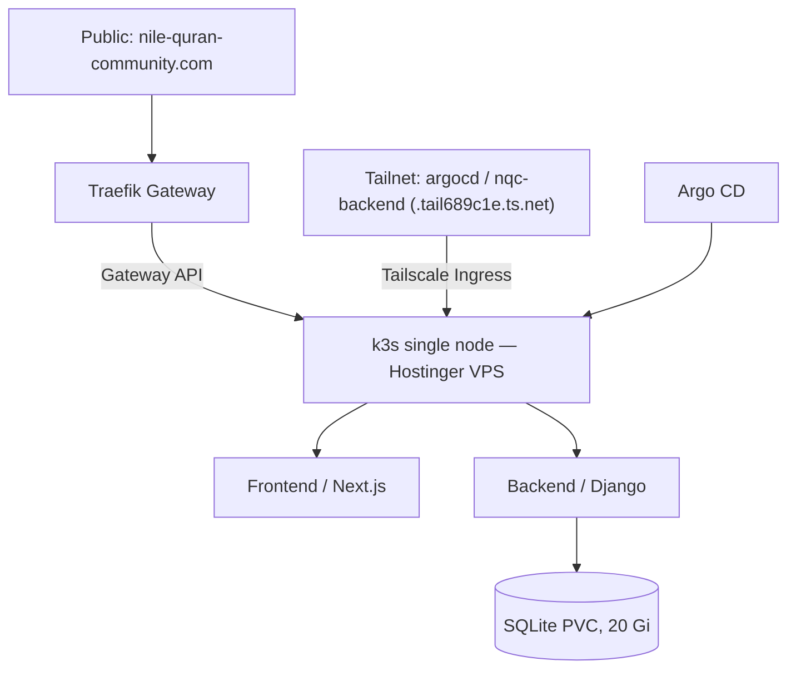

# Nile Quran Community — Infrastructure

Infrastructure-as-code, GitOps, and cluster manifests for the [Nile Quran Community](https://nile-quran-community.com) platform.

Everything in this repository is declarative: the host is provisioned with Ansible, the cluster is driven by Argo CD, and changes land on `main` through pull requests.

## Architecture



- A single [Hostinger](https://www.hostinger.com/eg) VPS (2 vCPU, 8 GiB RAM) runs a single-node [k3s](https://k3s.io) cluster (`v1.36.2+k3s1`) with Traefik enabled.
- Public traffic is routed through the Gateway API: a Traefik `Gateway` named `main` terminates TLS and routes `HTTPRoute`s to the services.
- [cert-manager](https://cert-manager.io) issues the Let's Encrypt certificate for the public domain.
- [Argo CD](https://argoproj.github.io/cd/) is the GitOps engine. It watches this repository and reconciles the cluster. It is **not** on the public internet — it is reachable only over [Tailscale](https://tailscale.com) at `https://argocd.tail689c1e.ts.net/` (the backend API is likewise tailnet-only at `https://nqc-backend.tail689c1e.ts.net/`).

## Components

| Component              | Description                                                                                  |
| ---------------------- | -------------------------------------------------------------------------------------------- |
| `nile-quran-community` | The website: Next.js frontend + Django backend with a SQLite PVC.                            |
| `argocd`               | Argo CD server, root `Application`, RBAC, tailnet-only Ingress.                              |
| `cert-manager`         | Let's Encrypt issuer with Gateway API HTTP-01 solver.                                        |
| `sealed-secrets`       | Encrypts Kubernetes secrets so they can live in git.                                         |
| `tailscale`            | Tailscale operator: tailnet-only access to Argo CD, the backend API, and the Kubernetes API. |
| `traefik`              | The `main` Gateway and HTTP→HTTPS redirect (Traefik itself ships with k3s).                  |

The ApplicationSet under `cluster/appset.yml` generates one Argo CD Application per directory in `cluster/apps/*` — each app is deployed into the namespace matching its directory name.

## Repository layout

```
.
├── ansible/                  # Host provisioning (Ansible)
│   ├── 0-setup.yml           # Create admin users + SSH keys
│   ├── 1-k3s.yml             # Bootstrap k3s (k3s-ansible collection)
│   ├── inventory/            # Host inventory, group/host vars, ansible-vault
│   └── requirements.yml      # k3s-ansible collection (v1.2.1)
└── cluster/                  # GitOps (Argo CD)
    ├── appset.yml            # ApplicationSet → one app per cluster/apps/* dir
    └── apps/
        ├── argocd/               # Argo CD + root Application + tailnet Ingress
        ├── cert-manager/         # cert-manager + letsencrypt ClusterIssuer
        ├── sealed-secrets/       # Bitnami Sealed Secrets
        ├── tailscale/            # Tailscale operator (tailnet-only access)
        ├── traefik/              # main Gateway + HTTP→HTTPS redirect
        └── nile-quran-community/ # Website frontend/backend resources
```

## Domains

| Domain                     | Purpose                               |
| -------------------------- | ------------------------------------- |
| `nile-quran-community.com` | Main website (HTTP → HTTPS redirect). |

### Tailnet-only endpoints

These are exposed via the Tailscale operator and are reachable only from devices on the tailnet. Access requires an explicit invite from a tailnet admin.

| Endpoint                                 | Purpose      |
| ---------------------------------------- | ------------ |
| `https://argocd.tail689c1e.ts.net/`      | Argo CD UI.  |
| `https://nqc-backend.tail689c1e.ts.net/` | Backend API. |

## Local development

The toolchain is managed with [mise](https://mise.jdx.dev). Install the tools and pre-commit hooks with:

```sh
mise --locked run install
pre-commit install
```

See [CONTRIBUTING.md](CONTRIBUTING.md) for the full workflow.

## Bootstrap a new host

These playbooks were used to build the current VPS and can be re-run against a fresh host:

1. `ansible-playbook 0-setup.yml` — creates the admin users (`ibrahim`, `youssef`) and installs their SSH keys.
2. `ansible-playbook 1-k3s.yml` — bootstraps k3s via the `k3s.orchestration` collection (`k3s-ansible`), including Traefik.
3. Install Argo CD into the cluster (`cluster/apps/argocd`), which then takes over as the GitOps engine and reconciles everything else from `main`.

## Security notes

- Kubernetes secrets are committed as [Sealed Secrets](https://github.com/bitnami-labs/sealed-secrets) (`kubeseal`) and can only be decrypted by the controller in the cluster.
- Argo CD and the backend API are not exposed to the public internet. They are served through the [Tailscale Kubernetes operator](https://tailscale.com/kb/1236/kubernetes-operator) and are reachable only from devices on the tailnet; joining requires an explicit invite from a tailnet admin.
